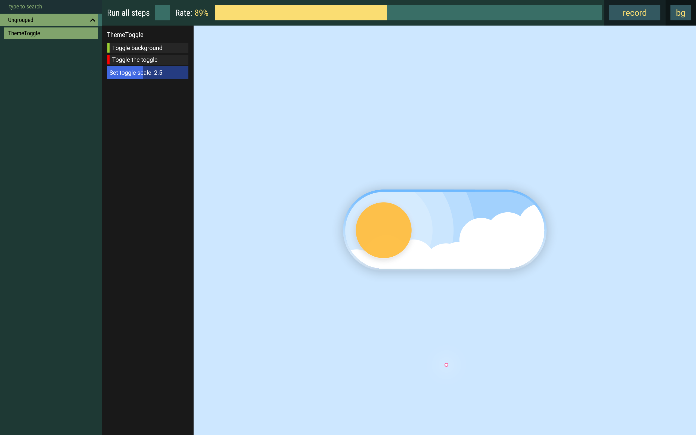
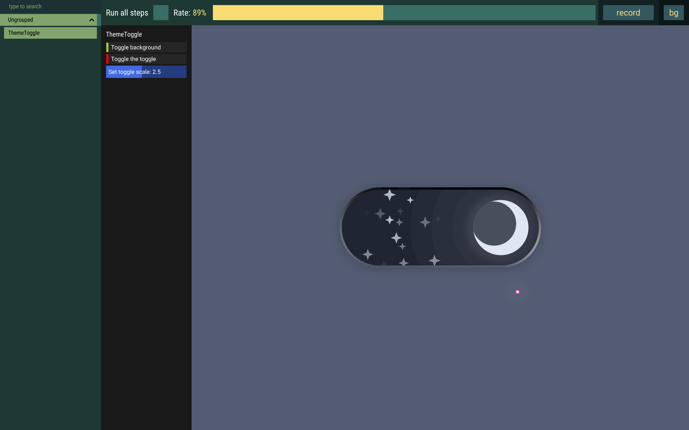

# Animated Theme Toggle

The animated theme toggle from the popular meme implemented in osu!framework.

To test locally, simply run:

```bash
dotnet run --project ThemeSwitch.Game.Tests
```

## Features

- Most objects are animated
- Draggable

## Screenshots and GIFs





